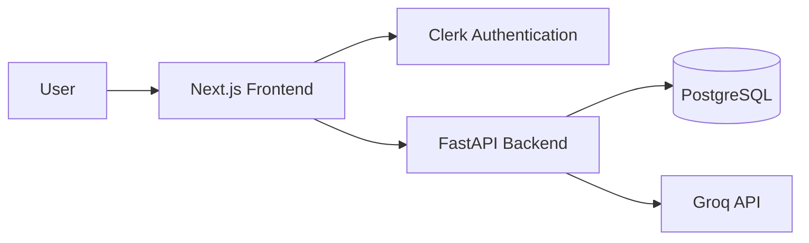
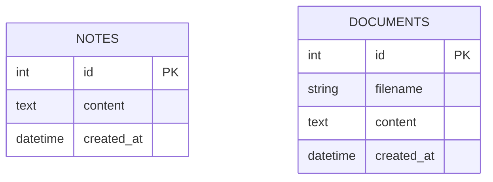
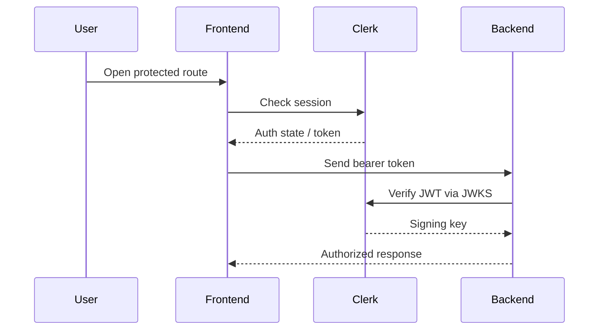
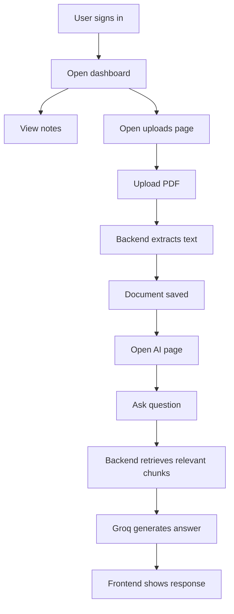
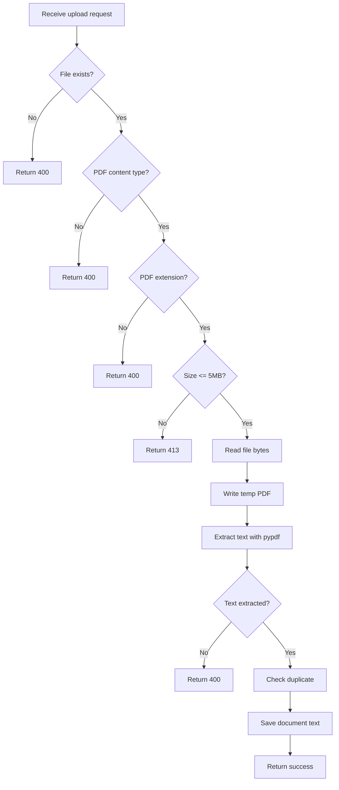
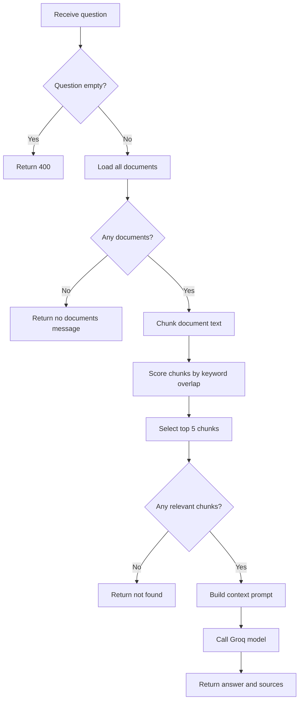
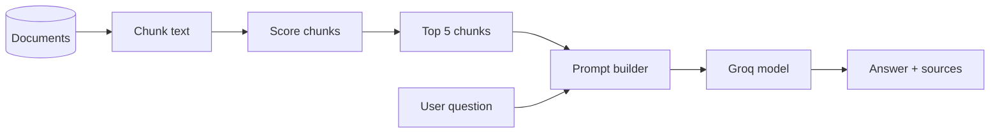

# Second Brain App

> A full-stack knowledge workspace for notes, PDF uploads, and AI-powered question answering over uploaded document content.

## 1. Project Snapshot

### What this project is

Second Brain App is a personal knowledge system built as a modern dashboard-style web app. It combines:

- note storage
- PDF uploads
- document text extraction
- AI question answering over uploaded documents
- authenticated workspace navigation

The current codebase is an MVP with a polished frontend shell and a working backend for notes, uploads, and AI Q&A.

### Project at a glance

| Area | Current Status | Notes |
|---|---|---|
| Authentication | Working | Clerk protects the frontend routes |
| Notes listing | Working | Notes are fetched from FastAPI |
| Note creation API | Working | Backend supports it, active routed UI does not expose it directly |
| PDF upload | Working | Only PDFs are accepted |
| PDF text extraction | Working | Uses `pypdf` |
| Document listing | Working | Uploads page shows stored documents |
| AI Q&A over uploads | Working | Uses retrieval + Groq |
| Memory search page | Prototype | Uses mock frontend data |
| Per-user data isolation | Not implemented | All authenticated users currently share stored notes/documents |
| Vector DB retrieval | Not active | `backend/rag.py` is prototype-only |

## 2. Product Idea

### Core idea

| Goal | Meaning in this app |
|---|---|
| Capture | Save knowledge as notes |
| Collect | Upload reference PDFs |
| Retrieve | Search or query stored knowledge |
| Ask AI | Get answers grounded in document content |
| Organize | Navigate all knowledge from one workspace |

### Who this app is for

| User Type | Why this app helps |
|---|---|
| Students | Save notes and query study PDFs |
| Researchers | Upload papers and ask focused questions |
| Founders / builders | Keep ideas, docs, and quick references in one place |
| Personal productivity users | Treat the app like a memory OS |

## 3. Tech Stack

### Frontend stack

| Technology | Purpose |
|---|---|
| Next.js 16 | App framework |
| React 19 | UI layer |
| TypeScript | Type safety |
| Tailwind CSS 4 | Styling |
| Clerk | Authentication |
| Axios | API requests |
| Framer Motion | UI animations |
| Lucide React | Icons |
| `clsx` | Conditional classes |

### Backend stack

| Technology | Purpose |
|---|---|
| FastAPI | API framework |
| Uvicorn | ASGI server |
| SQLAlchemy | ORM / DB access |
| PostgreSQL via `psycopg2-binary` | Database driver |
| `python-dotenv` | Environment loading |
| `pypdf` | PDF text extraction |
| `PyJWT` + Clerk JWKS | Token verification |
| Groq SDK | AI answer generation |
| `python-multipart` | File uploads |

### AI / Retrieval stack

| Layer | Current Implementation |
|---|---|
| Retrieval source | Stored PDF text in database |
| Chunking | Character chunking with overlap |
| Ranking | Keyword overlap scoring |
| Generation model | `llama-3.1-8b-instant` via Groq |
| Source return | Backend returns source metadata |
| Vector search | Not active in live flow |

## 4. High-Level Architecture



### Responsibility map

| Layer | Responsibility |
|---|---|
| Frontend | Pages, auth-aware UI, API calls, chat/upload/note displays |
| Clerk | Sign-up, sign-in, session handling, token issuance |
| Backend | Validation, database access, PDF processing, retrieval, AI prompting |
| Database | Stores note text and extracted document text |
| Groq | Generates answers from retrieved document chunks |

## 5. Repository Structure

```text
second-brain-app/
├── backend/
│   ├── main.py
│   ├── database.py
│   ├── models.py
│   ├── auth.py
│   ├── rag.py
│   ├── requirements.txt
│   ├── Procfile
│   └── runtime.txt
├── frontend/
│   ├── src/app/
│   ├── src/components/
│   ├── middleware.ts
│   └── package.json
├── middleware.ts
└── README.md
```

### Important files

| File | Role |
|---|---|
| `backend/main.py` | Active FastAPI app and routes |
| `backend/database.py` | DB engine and session setup |
| `backend/models.py` | SQLAlchemy models |
| `backend/rag.py` | Prototype RAG path, not used by live app |
| `frontend/src/app/page.tsx` | Routed dashboard page |
| `frontend/src/app/notes/page.tsx` | Notes view |
| `frontend/src/app/uploads/page.tsx` | Upload manager |
| `frontend/src/app/memory/page.tsx` | Mock memory search page |
| `frontend/src/app/ai/page.tsx` | AI chat page |
| `frontend/src/components/layout/Sidebar.tsx` | Main workspace navigation |
| `frontend/src/components/layout/Topbar.tsx` | Top navigation bar |
| `frontend/middleware.ts` | Clerk route protection |

## 6. Frontend Pages

### Route map

| Route | Purpose | Status |
|---|---|---|
| `/` | Dashboard | Live |
| `/notes` | Notes list and reader | Live |
| `/uploads` | Upload and document library | Live |
| `/memory` | Memory search UI | Prototype |
| `/ai` | Chat with uploaded documents | Live |
| `/sign-in` | Login page | Live |
| `/sign-up` | Registration page | Live |

### Page behavior summary

| Page | What user sees | Backend connection |
|---|---|---|
| Dashboard | Recent notes summary | `GET /notes` |
| Notes | Notes list + selected note panel | `GET /notes` |
| Uploads | PDF upload panel + uploaded docs list | `GET /documents`, `POST /upload` |
| Memory | Search UI over mock records | None yet |
| AI | Chat box + uploaded source list | `GET /documents`, `POST /ask` |

## 7. Backend API

### API summary

| Method | Endpoint | Purpose | Auth |
|---|---|---|---|
| `GET` | `/` | Health/root response | No |
| `GET` | `/notes` | Fetch notes | Yes |
| `POST` | `/notes` | Create note | Yes |
| `POST` | `/upload` | Upload PDF and extract text | Yes |
| `GET` | `/documents` | Fetch uploaded documents | Yes |
| `POST` | `/ask` | Ask AI over uploaded docs | Yes |

### Request/response examples

#### Create note

```json
POST /notes
{
  "content": "Meeting notes for product review"
}
```

#### Ask AI

```json
POST /ask
{
  "question": "What does the uploaded document say about memory retrieval?"
}
```

#### Upload validation rules

| Rule | Value |
|---|---|
| Allowed file type | PDF only |
| Allowed content type | `application/pdf` |
| Required extension | `.pdf` |
| Max size | 5 MB |
| Empty file allowed | No |

## 8. Data Model

### Database tables

| Table | Columns | Purpose |
|---|---|---|
| `notes` | `id`, `content`, `created_at` | Stores notes |
| `documents` | `id`, `filename`, `content`, `created_at` | Stores extracted PDF text and metadata |

### Data model diagram



### Important limitation

| Limitation | Impact |
|---|---|
| No `user_id` in `notes` | Notes are not scoped per user |
| No `user_id` in `documents` | Uploaded documents are not scoped per user |

## 9. Authentication Flow



### Auth behavior summary

| Step | What happens |
|---|---|
| 1 | Clerk protects frontend routes |
| 2 | Frontend gets token via `useAuth().getToken()` |
| 3 | Token is sent to FastAPI in `Authorization: Bearer ...` |
| 4 | Backend verifies JWT using Clerk JWKS |
| 5 | Backend extracts `sub` as `user_id` |

## 10. User Flow

### Full user journey



### User flow by feature

| Feature | User action | System result |
|---|---|---|
| Sign in | User authenticates with Clerk | Protected pages become accessible |
| View notes | User opens dashboard or notes page | Frontend fetches notes |
| Upload PDF | User uploads a file | Backend validates, extracts, and stores text |
| View uploads | User opens uploads page | Stored document list is shown |
| Ask AI | User submits a question | Backend retrieves relevant chunks and returns an answer |
| Search memory | User types in memory search box | Mock results are filtered client-side |

## 11. Project Flow

### Backend processing flow for uploads



### Backend processing flow for AI Q&A



## 12. Retrieval / RAG Design

### Current live RAG pipeline

| Stage | Implementation |
|---|---|
| Source data | Extracted PDF text from `documents` table |
| Cleaning | Whitespace normalization |
| Chunking | 800-character chunks with 120-character overlap |
| Matching | Word overlap scoring |
| Top results | Best 5 chunks |
| Prompting | Context + user question |
| Output | Concise factual answer |

### RAG logic diagram



### Current limitations of retrieval

| Limitation | Explanation |
|---|---|
| No embeddings | Retrieval is keyword-based |
| No semantic similarity search | Wording mismatch can reduce answer quality |
| Documents only | Notes are not part of AI retrieval |
| Sources not shown in UI | Backend returns sources but frontend does not render them |

## 13. Environment Variables

### Backend

| Variable | Required | Purpose |
|---|---|---|
| `DATABASE_URL` | Yes | Database connection |
| `GROQ_API_KEY` | Yes | Groq access |
| `CLERK_JWKS_URL` | Yes | Clerk JWT verification |
| `ALLOWED_ORIGINS` | No | CORS allowlist, defaults to `http://localhost:3000` |

### Frontend

| Variable | Required | Purpose |
|---|---|---|
| `NEXT_PUBLIC_API_URL` | Yes | Backend base URL |

### Clerk note

The frontend uses Clerk through `ClerkProvider` and Clerk components, so standard Clerk environment variables are also expected during real setup, even though their exact names are not directly referenced in this codebase.

## 14. Local Setup

### Prerequisites

| Requirement | Needed for |
|---|---|
| Node.js + npm | Frontend |
| Python 3.10 | Backend |
| PostgreSQL | Database |
| Clerk project | Authentication |
| Groq API key | AI answers |

### Backend setup

```bash
cd backend
python -m venv .venv
source .venv/bin/activate
pip install -r requirements.txt
uvicorn main:app --reload --host 0.0.0.0 --port 8000
```

### Frontend setup

```bash
cd frontend
npm install
npm run dev
```

### Local URLs

| Service | URL |
|---|---|
| Frontend | `http://localhost:3000` |
| Backend | `http://localhost:8000` |

## 15. Deployment Hints

### Deployment clues already in repo

| File | Meaning |
|---|---|
| `backend/Procfile` | Procfile-style backend deployment |
| `backend/runtime.txt` | Python runtime pin |

### Backend start command

```bash
uvicorn main:app --host 0.0.0.0 --port $PORT
```

## 16. Current Strengths

| Strength | Why it matters |
|---|---|
| Clean frontend navigation | Easy to understand product areas |
| Working auth integration | Secure access to workspace pages |
| Real PDF-to-text processing | Documents become queryable |
| Working AI answer path | App already demonstrates useful RAG behavior |
| Clear MVP separation | Core logic is understandable and extendable |

## 17. Current Gaps / Risks

| Gap | Why it matters |
|---|---|
| No per-user DB ownership | Biggest privacy and correctness issue |
| Memory page is mock-only | Feature looks more complete than it is |
| Old prototype files exist | Can confuse contributors |
| No migrations | Schema changes will be harder to manage |
| Keyword retrieval only | Lower retrieval quality than semantic search |
| Sources not shown in AI UI | Users cannot inspect evidence directly |

## 18. Prototype vs Live Code

### Live routed pages

| Live file | Used by route |
|---|---|
| `frontend/src/app/page.tsx` | `/` |
| `frontend/src/app/notes/page.tsx` | `/notes` |
| `frontend/src/app/uploads/page.tsx` | `/uploads` |
| `frontend/src/app/memory/page.tsx` | `/memory` |
| `frontend/src/app/ai/page.tsx` | `/ai` |

### Prototype / extra files

| File | Status |
|---|---|
| `frontend/src/app/Homepage.tsx` | Prototype / not routed |
| `frontend/src/app/HomeUI.tsx` | Prototype / not routed |
| `frontend/src/app/notes/Homepage.tsx` | Prototype / not routed |
| `frontend/src/app/uploads/Homepage.tsx` | Prototype / not routed |
| `frontend/src/app/memory/Homepage.tsx` | Prototype / not routed |
| `frontend/src/app/ai/AIPage.tsx` | Prototype / not routed |
| `backend/auth.py` | Old helper, not used by active backend flow |
| `backend/rag.py` | Prototype retrieval path, not wired into active routes |

## 19. Recommended Next Steps

| Priority | Improvement |
|---|---|
| High | Add `user_id` to notes and documents |
| High | Filter every query by authenticated user |
| High | Connect memory page to real backend search |
| Medium | Render AI source citations in frontend |
| Medium | Replace keyword retrieval with embeddings/vector search |
| Medium | Remove or archive obsolete prototype files |
| Medium | Add DB migrations |
| Medium | Add backend/frontend tests |

## 20. Short Summary

Second Brain App is a full-stack authenticated knowledge workspace with a Next.js frontend and a FastAPI backend. Users can sign in, browse notes, upload PDFs, and ask AI questions about uploaded documents. The live AI flow already works, but the project is still in MVP stage because user data is not isolated, memory search is still mocked, and some prototype files remain in the repo.
